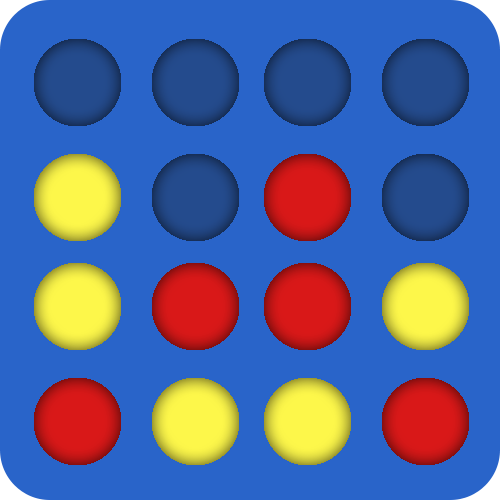
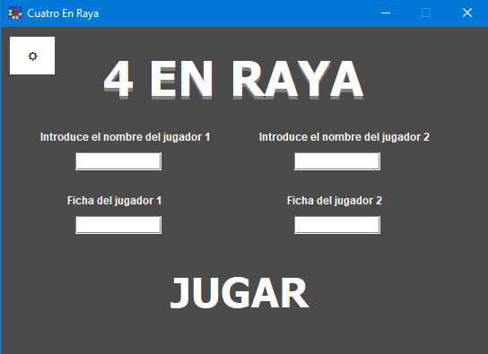
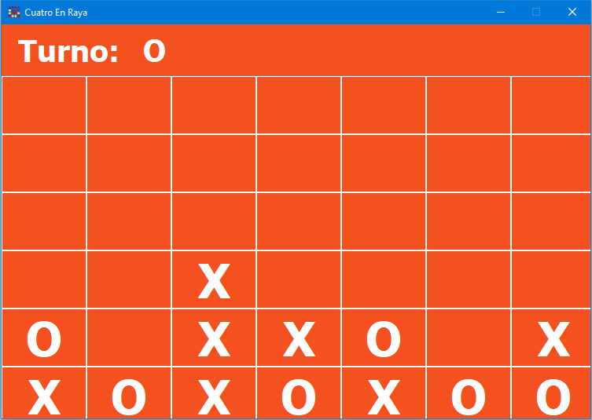
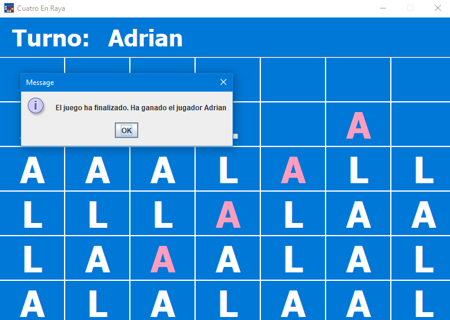

<!-- PROJECT LOGO -->
<br />
<div align="center">
  <a href="https://github.com/aaroncxsstro/Four-In-A-Row">
    
  </a>

<h3 align="center">FOUR IN A ROW</h3>

  <p align="center">
Immerse yourself in the classic strategy and enjoyment of Four in a Row with my Java Swing implementation. Challenge a friend to a thrilling match by seamlessly switching the mouse between turns
    <br />
    <br />
  </p>
</div>

<!-- TABLE OF CONTENTS -->
<details>
  <summary>Table of Contents</summary>
  <ol>
    <li>
      <a href="#about-the-project">About The Project</a>
    </li>
    <li>
      <a href="#getting-started">Getting Started</a>
      <ul>
        <li><a href="#prerequisites">Prerequisites</a></li>
        <li><a href="#installation">Installation</a></li>
      </ul>
    </li>
    <li><a href="#contact">Contact</a></li>
  </ol>
</details>


## About The Project

<div align="center">
  
</div>

Choose any characters you desire for your discs—gone are the days of being limited to just 'O' and 'X'. The intuitive and user-friendly interface enhances the overall experience, making it accessible.
    <br />
    <br />
    <br />
<div align="center">
  
</div>
    <br />
    <br />
    <br />
<div align="center">
  
</div>


## Getting Started

This section provides instructions on setting up and running the Four-In-A-Row project locally. Follow these steps to ensure a smooth setup.

### Prerequisites

Ensure you have the following installed before proceeding:

* [Eclipse](https://www.eclipse.org/downloads/) - Integrated development environment (IDE)
* [JDK 1.8](https://www.oracle.com/java/technologies/javase/javase-jdk8-downloads.html) - Java Development Kit version 1.8

### Installation

1. Clone the repository
   ```sh
   git clone https://github.com/aaroncxsstro/Four-In-A-Row.git

2. Import it to eclipse (Or just execute the jar file in the root of the project!)

## License

**Note:** While the general concept of the game, "Four in a Row," is not my original idea and is widely recognized as a classic game, I want to clarify that I developed all aspects of this specific implementation. The design, code, and other resources used in the game are my own creations, but the fundamental concept of a four-in-a-row game is a well-established and widely known idea.


## Contact

Aaron Castro - aaroncasstroarias@gmail.com
    <br />
Project Link: [Four-In-A-Row](https://github.com/aaroncxsstro/Four-In-A-Row)

